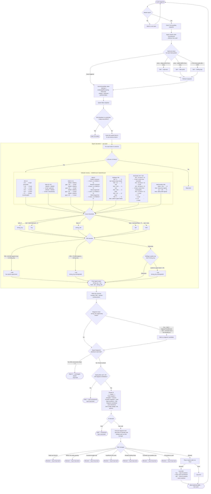

# Engine Decision Tree

```mermaid
flowchart TD
    START([Cycle triggered]) --> MKT{Market open?}
    MKT -- No --> WAIT[Wait for next open] --> START
    MKT -- Yes --> SNAP[Fetch T212 portfolio snapshot]

    SNAP --> CASHACCT["Apply session cash commitments
    → effective free cash"]
    CASHACCT --> HARDCHECK{Hard exit check
    for each held position}

    HARDCHECK -- "price ↓ stopLossPct from entry" --> SL[Sell — stop-loss]
    HARDCHECK -- "price ↑ takeProfitPct from entry" --> TP[Sell — take-profit]
    HARDCHECK -- "↓ 0.4% from peak after ↑ 0.8%" --> TS[Sell — trailing stop]
    HARDCHECK -- None triggered --> BOTVAL
    SL & TP & TS --> REFRESHSNAP[Refresh snapshot] --> BOTVAL

    BOTVAL["Calc bot portfolio value
    botCash = min(budgetRemaining, freeCash)
    aiValue = botCash + positionsValue"]
    BOTVAL --> UPSERT[Upsert daily snapshot]
    UPSERT --> DLCHECK{Bot drawdown vs yesterday
    > dailyLossLimitPct?}
    DLCHECK -- Yes --> HALT([HALT for today])
    DLCHECK -- No --> HISTORY

    HISTORY["Fetch 90-candle OHLCV
    for all universe tickers"]
    HISTORY --> TICKERLOOP

    subgraph SIGNAL_ENGINE["Signal calculation — per ticker"]
        TICKERLOOP["For each ticker in universe"] --> ENOUGHDATA{"≥ 30 bars of history?"}
        ENOUGHDATA -- No --> SKIPTIC[Skip ticker]
        ENOUGHDATA -- Yes --> SCORING

        subgraph SCORING["Indicator scoring → bullishCount / bearishCount"]
            RSI_S["RSI 14
            < 30  →  +3 bull  (oversold)
            < 45  →  +2 bull
            < 55  →  +1 bull
            > 60  →  +1 bear
            > 65  →  +2 bear
            > 75  →  +3 bear  (overbought)"]

            SMA_S["SMA 20 / 50
            SMA20 > SMA50  →  +2 bull  (uptrend)
            SMA20 < SMA50  →  +2 bear  (downtrend)"]

            EMA_S["EMA 9 / 21
            EMA9 > EMA21, gap > 1%  →  +3 bull
            EMA9 > EMA21, gap ≤ 1%  →  +2 bull
            EMA9 < EMA21, gap > 1%  →  +2 bear
            EMA9 < EMA21, gap ≤ 1%  →  +1 bear"]

            MACD_S["MACD
            Bullish crossover  →  +3 bull  (+1 if MACD > 0)
            Bearish crossover  →  +3 bear  (+1 if MACD < 0)
            Above signal line  →  +1 bull  (+1 if MACD > 0)
            Below signal line  →  +1 bear  (+1 if MACD < 0)"]

            BOLL_S["Bollinger %B
            %B < 0     →  +3 bull  (below lower band)
            %B < 0.2   →  +2 bull
            %B < 0.35  →  +1 bull
            %B > 0.65  →  +1 bear
            %B > 0.8   →  +2 bear
            %B > 1     →  +3 bear  (above upper band)"]

            STOCH_S["Stochastic %K / %D
            %K < 20 and K > D  →  +3 bull  (cross from oversold)
            %K < 30 and K > D  →  +2 bull
            %K > 80 and K < D  →  +3 bear  (cross from overbought)
            %K > 70 and K < D  →  +2 bear
            K > D              →  +1 bull
            K < D              →  +1 bear"]

            HELD_S["Held position P&L
            down > 5%  →  +4 bear  (stop-loss signal)
            up   > 2%  →  +4 bear  (take-profit signal)"]
        end

        RSI_S & SMA_S & EMA_S & MACD_S & BOLL_S & STOCH_S & HELD_S --> CLASSIFY

        CLASSIFY{"Score thresholds"}
        CLASSIFY -- "bull ≥ 7" --> PRE_SB[strong_buy]
        CLASSIFY -- "bull > bear (and bull < 7)" --> PRE_B[buy]
        CLASSIFY -- "bear ≥ 7" --> PRE_SS[strong_sell]
        CLASSIFY -- "bear > bull (and bear < 7)" --> PRE_S[sell]
        CLASSIFY -- "bull = bear" --> PRE_H[hold]

        PRE_SB & PRE_B & PRE_SS & PRE_S & PRE_H --> RSI_OVR

        RSI_OVR{"RSI override"}
        RSI_OVR -- "RSI > 80 AND signal is buy or strong_buy" --> CAP_HOLD["→ hold
        buy signal suppressed"]
        RSI_OVR -- "RSI > 70 AND signal is strong_buy" --> CAP_BUY["→ buy
        strong_buy downgraded"]
        RSI_OVR -- Otherwise --> BOLL_OVR

        CAP_HOLD & CAP_BUY --> SIG_OUT
        BOLL_OVR{"Bollinger upside cap
        only if strong_buy"}
        BOLL_OVR -- "upside to upper band < 2%" --> CAP_BUY2["→ buy
        strong_buy downgraded"]
        BOLL_OVR -- Otherwise --> SIG_OUT
        CAP_BUY2 --> SIG_OUT
        SIG_OUT(["Final signal output
        strong_buy · buy · hold · sell · strong_sell"])
    end

    SIG_OUT --> BUYUNIVERSE["Filter buy universe
    exclude: held · manual · cooling tickers"]
    BUYUNIVERSE --> STAGNANT{"Stagnant check
    strong_buy opportunity exists?"}

    STAGNANT -- "Yes + held > stagnantTimeMinutes
    + flat + at break-even + not trending up" --> STAGMARK[Mark as stagnant candidate]
    STAGNANT -- No --> FP
    STAGMARK --> FP

    FP{"Signal fingerprint
    identical to last hold?"}
    FP -- "Yes AND consecutive skips < 4" --> SKIPAI([Skip AI — unchanged signals
    loop back])
    FP -- No / forced recheck --> CASHCK

    CASHCK{"Deployable cash ≥ €6
    OR stagnant candidates?"}
    CASHCK -- No --> HOLDCASH([Hold — cash constrained
    log & loop back])
    CASHCK -- Yes --> CLAUDE

    CLAUDE["Claude AI
    ── Inputs ──
    Ticker signals + strengths + reasons
    Portfolio snapshot + cash
    Open positions + P&L
    Stagnant candidates
    Last 5 decisions
    User config: budget, risk params"]

    CLAUDE --> AIDEC{AI decision}
    AIDEC -- hold --> HOLDAI([Hold — AI decision
    log & loop back])
    AIDEC -- buy / sell --> STAGEXEC

    STAGEXEC["Execute stagnant exits
    skip ticker AI already sold
    validate each via risk manager"]
    STAGEXEC --> RISK

    RISK{"Risk manager"}
    RISK -- Daily loss limit hit --> BLK1([Blocked — log & loop back])
    RISK -- Below min trade quantity --> BLK2([Blocked — log & loop back])
    RISK -- Exceeds budget cap --> BLK3([Blocked — log & loop back])
    RISK -- Insufficient free cash --> BLK4([Blocked — log & loop back])
    RISK -- Already holding ticker --> BLK5([Blocked — log & loop back])
    RISK -- Exceeds max position size --> BLK6([Blocked — log & loop back])
    RISK -- No position to sell --> BLK7([Blocked — log & loop back])
    RISK -- Allowed --> ORDER

    ORDER[Place market order via T212]
    ORDER -- Success --> LOGOK["Log order
    buy → open AI position + track cash commitment
    sell → close AI position + start cooldown"]
    ORDER -- Error --> LOGERR[Log error]

    LOGOK --> NEXT([Wait tradeIntervalMs → next cycle])
    LOGERR --> NEXT
    NEXT --> START
```
